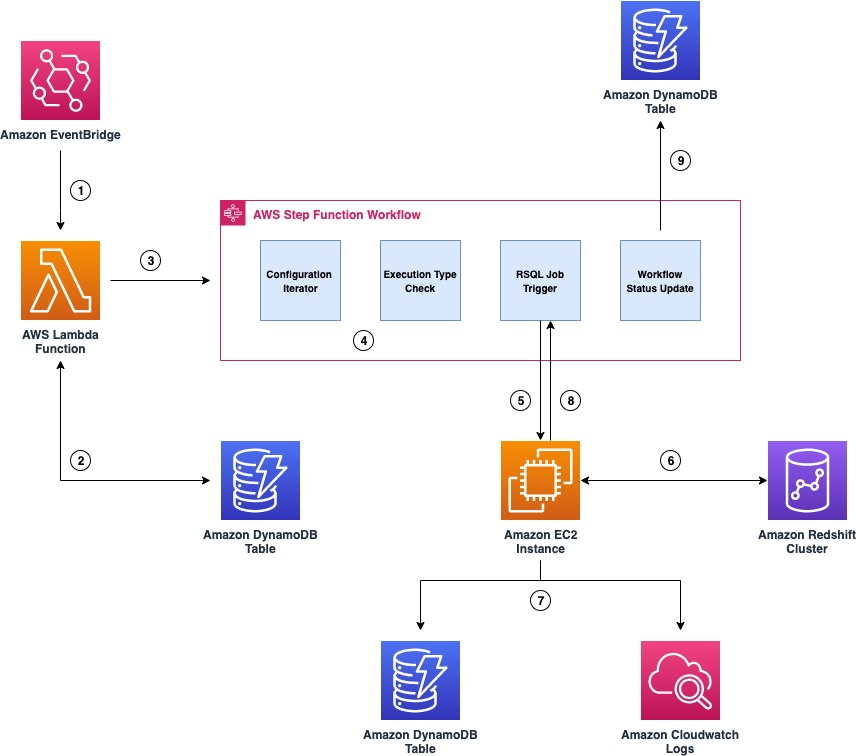
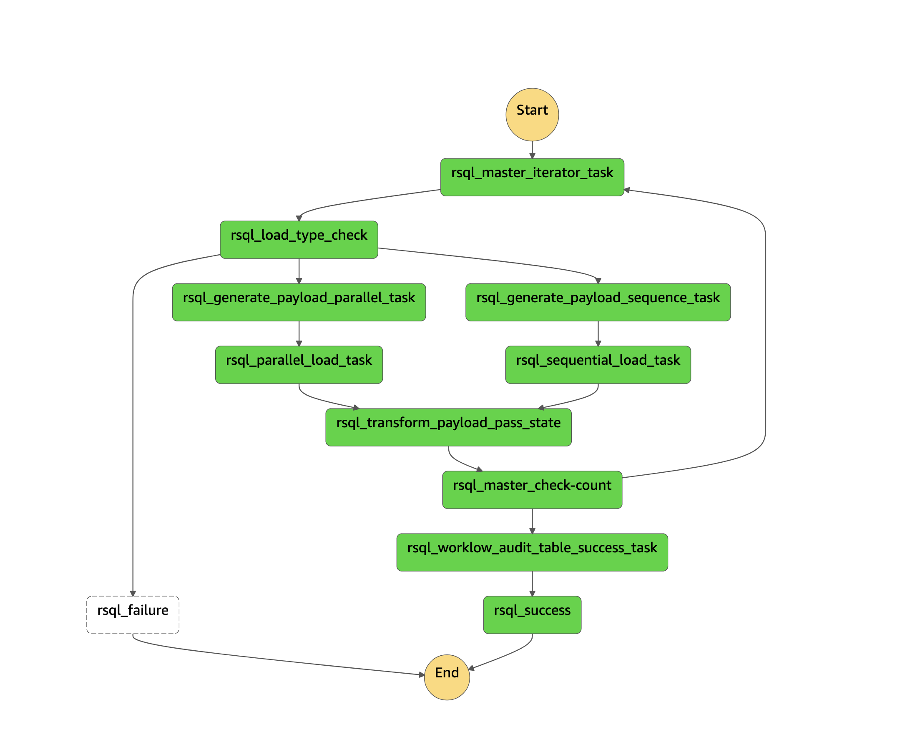

# Generic RSQL Orchestration Framework

Customers migrating from legacy data warehouses to Amazon Redshift, may have a significant
investment in proprietary scripts like Basic Teradata Query (BTEQ) scripting for database
automation, ETL, or other tasks. Customers can now use AWS Schema Conversion Tool (AWS
SCT) to automatically convert proprietary scripts like BTEQ scripts to Amazon Redshift RSQL
scripts. The converted scripts run on Amazon Redshift with little to no changes. 

During such migrations customers also want to modernize their current on-premises, third
party orchestration tools with a cloud native framework to replicate and enhance their current orchestration capability. Orchestrating data warehouse workloads include, scheduling the jobs, checking if the pre-conditions have been met, executing the business logic embedded within RSQL, monitoring the status of the jobs and alerting if there is any failures

This solution allows on-premises customers to migrate to a cloud native orchestration
framework which uses AWS serverless services such as AWS Step Functions, AWS Lambda,
Amazon DynamoDB, and AWS Systems Manager to execute the Amazon Redshift RSQL Jobs
deployed on a Persistent EC2 Instance. The solution can also be deployed for greenfield
implementations. In addition to meeting functional requirements, this solution also provides
full auditing, logging, and monitoring of all ETL/ELT processes that are executed

The following diagram illustrates the architecture of the Orchestration framework:




The deployment is fully automated using AWS Cloud Development Kit (AWS CDK) and comprises of the following stacks:

1. `RSQLCloudwatchStack` - Creates a Amazon Cloudwatch log group that stores the RSQL job logs.
2. `RSQLDynamodbStack` - Creates Amazon DynamoDB tables which store the configurations and the audit details.
3. `RSQLLambdaStack` - Creates the AWS Lambda functions which is used within the Orchestration Framework
4. `RSQLStepFunctionStack` - Creates the AWS Step Functions and the trigger AWS Lambda Function.

## Deploy AWS CDK stacks
Before deploying the AWS CDK stacks, update the environment parameters in `cdk.json` within `infra`

To deploy the Generic RSQL Orchestration Framework solution, use the following code.
Replace `123456789012` with your AWS account number, `us-east-1` with the AWS Region to which you want deploy the solution.

```
git clone https://gitlab.aws.dev/bnakhi/amazon-redshift-rsql-orchestration-framework.git
cd amazon-redshift-rsql-orchestration-framework/lambdas/lambda-layer/
sh zip_lambda_layer.sh
cd ../../infra/
python3 -m venv ./venv
pip install -r requirements.txt
cdk bootstrap 123456789012/us-east-1
cdk deploy --all

```
The whole process takes few minutes to complete.

## Trigger the Lambda Function which eexecutes the Step Functions state machine
After AWS CDK finishes, a lambda function and state machine is created in your account called **rsql-blog-rsql-workflow-trigger-lambda** and **rsql-master-state-machine** respectively. To run it, complete the following steps:

1. Navigate to Lambda console.
2. Choose the function to open the details page.
3. Choose **Test**, and then choose **Configure test event**. Create a test event using the below json document

```
{
  "workflow_id": "blog_test_workflow",
  "workflow_execution_id": "demo_test_26"
}
```
4. Navigate to Step Functions console and select the state machine.
5. Within **Executions**, you'll find a new execution with the same name as workflow_execution_id. (i.e. demo_test_26)

The Graph view on the details page updates in real time. Using the Graph view, you can check the status of each state by choosing it. Every state that uses an external resource has a link to it on the Details tab.

## Security

See [CONTRIBUTING](CONTRIBUTING.md#security-issue-notifications) for more information.

## License

This project is licensed under the MIT-0 License.


